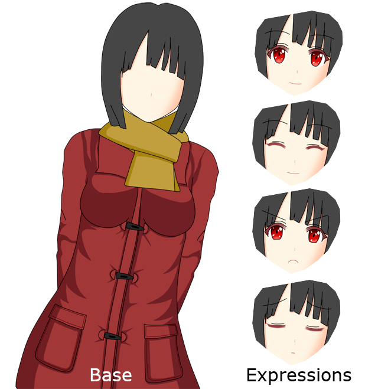

Your first game with Iris Engine
================================

The purpose of this tutorial is to demonstrate how you can make a simple visual
novel using Iris Engine from start to finish.

Preparations
------------

The first thing you'll need to do is download `the latest version of Iris Engine <https://github.com/diegodan1893/Iris-Engine/releases/latest>`_.

Then, create a folder for your game and unzip the contents of ``Iris-Engine.zip`` to
that folder.

You should see a file called ``Iris Engine.exe``, it will be the executable of your
game. You can rename it if you want.

If you try to run the game right now you'll get an error. That's because you need a
template for your game. In this tutorial we are going to make a 720p visual novel, so
go ahead and download the `720p Visual Novel Template <https://github.com/diegodan1893/Iris-Engine-Templates/releases/latest>`_.

Unzip the contents of ``720p-VN-Template.zip`` to the folder of your game, so that
``config.lua`` is in the same folder as the executable of your game.

If you try to run the game now, you should see something like this:

Now open ``config.lua`` in any text editor. I personally recommend using
`Sublime Text`_, `Visual Studio Code`_, or `Notepad++`_. You should find the
following line near the beginning of the file:

.. _Notepad++: https://notepad-plus-plus.org/
.. _Visual Studio Code: https://code.visualstudio.com/
.. _Sublime Text: https://www.sublimetext.com/

.. code-block:: lua

    name = "720p Template",

Replace the text in quotes with the name of your game as you want it to appear in the
title of the window. For example, if the name of your game is "Tutorial Game", you
should edit the line to look like this:

.. code-block:: lua

    name = "Tutorial Game",

Dialogue and narration
----------------------

Let's start with the actual game. Open ``assets/scripts/_start.lua`` in your text
editor. This file contains the first script your game will run. There is already some
code there from the template but we don't want it in our game, so delete it.

First, we are going to start by writing a bit of narration:

.. code-block:: lua

    say "I'm on my way home from class."
    say "There are more students than usual today."
    say "I guess that makes sense, midterms are coming closer and all club activities have been suspended."

To try this out, copy the code above into the script you just opened, save the
changes to the file and double click on the executable of your game to launch it.

As you can see, narration is written using the ``say`` word followed by the text of
the narration in quotes.

Let's try now to make a conversation between two characters. The first thing you'll
need to do is define them. Add the following code to the beginning of the script:

.. code-block:: lua

    h = Character.new("Haru")
    s = Character.new("Sakura")

These two lines define characters. The text in quotes is the name the player will
see, while the text before the ``=`` symbol is the internal name of the character in
the code of the script, in this case ``h`` for Haru and ``s`` for Sakura.

Now that the characters are defined, we can use ``h`` and ``s`` in the same way as
``say`` to write dialogue, like so:

.. code-block:: lua
    :emphasize-lines: 8,9,10,11,12

    h = Character.new("Haru")
    s = Character.new("Sakura")

    say "I'm on my way home from class."
    say "There are more students than usual today."
    say "I guess that makes sense, midterms are coming closer and all club activities have been suspended."

    s "Hi there, Haru! Are you going home now?"
    h "Yes I am. I want to study for the midterms."
    s "Well, about that... I wanted to ask you something."
    h "What is it?"
    s "Please, help me with maths!"

The main difference between using ``say`` and the characters we defined is that
the latter shows the name of the character that is speaking.

Images
------

Now that we know how to write the text of our game let's add some images, this is a
**visual** novel after all. I've prepared some images so that you can follow along,
`click here to download them`_. Just unzip the contents to your game folder.

.. _click here to download them: https://www.dropbox.com/s/m1ufn67akujjgzu/Tutorial-Images.zip?dl=1

Let's try adding a background to the game. Take a look at the content of
``assets/images/backgrounds``. Here are the images you can use as backgrounds for
your game. We are going to use ``street day.png``. Add the following line just after
the definition of the characters:

.. code-block:: lua

    scene("street day.png")

The ``scene`` function clears the screen and displays a background image, in this
case ``street day.png``. This is especially useful in cases where every character
leaves the scene or when the action of the story moves to another place, as it will
automatically hide all other images in the screen.

Now that we have a background, let's add a sprite for Sakura.

.. tip::
    In video games, 2D images of characters, items and other things are called
    sprites.

First, take a look at the content of ``assets/images/characters``. In Iris Engine,
character sprites are composed of a base, which is an image of the character without
a face, and a set of images with the facial expressions the character can make.

The reason for this is that it allows us to reuse the same expressions with different
base images, but that's out of the scope of this tutorial. For now, pay atenttion to
the name of the files.

In order to show a character sprite, we need to define it first in a similar way as
we did with characters in the previous section. Add the following code just after
the definition of the characters:

.. code-block:: lua

    sakura = CharacterSprite.new("sakura1.png")

Here, we define a character sprite that uses ``sakura1.png`` as the base image and
give it an internal name, in this case ``sakura``, so that we can refer to it later
in the script.

.. note::
    Before we continue, let's talk a bit about terminology. Here, ``sakura`` is
    what we call a **variable**. ``h`` and ``s`` are also variables.

    Variables are a powerful tool that allows us to give names to things so that
    we can use them later in the script.

Now that the sprite is defined, we can use ``sakura:show("expression")`` to display
it with that facial expression:

.. code-block:: lua
    :emphasize-lines: 4,12,17,22

    h = Character.new("Haru")
    s = Character.new("Sakura")

    sakura = CharacterSprite.new("sakura1.png")

    scene("street day.png")

    say "I'm on my way home from class."
    say "There are more students than usual today."
    say "I guess that makes sense, midterms are coming closer and all club activities have been suspended."

    sakura:show("smiling")

    s "Hi there, Haru! Are you going home now?"
    h "Yes I am. I want to study for the midterms."

    sakura:show("serious")

    s "Well, about that... I wanted to ask you something."
    h "What is it?"

    sakura:show("normal")

    s "Please, help me with maths."

The text in quotes is the name of the facial expression we want the character to
make. If the base image is ``sakura1.png`` and the name of the expression is
``smiling``, then the engine will display the image ``sakura1 smiling.png`` as the
facial expression.

You can hide a character sprite using ``hide``. For example, you can hide Sakura
with ``sakura:hide()``. This is useful when a character leaves but the scene stays
the same.

Choices
-------

Many visual novels allow the player to make decisions that influence the outcome
of the story. In this tutorial, we are going to let the player decide if they want
to help Sakura study maths or not.

The first thing we need to do is define what will happen when the player chooses
each option. In order to do that, we are going to do something very similar to what
we did with characters and character sprites. For each option, we are going to
define a block of code with the outcome of that decision, and we are going to
give a name to that block so that we can use it later.

These blocks of code are called **functions**, and they are defined like this:

.. code-block:: lua

    help = function()
        h "Okay, I will help you."
        sakura:show("happy")
        s "Really? Thanks!"
        h "No problem, it will help me review the subject."
    end

    dontHelp = function()
        sakura:show("nervious")
        h "Sorry, but that's my worst subject, I don't think I will be able to help."
        sakura:show("serious")
        s "Okay, no problem."
        s "I guess I will ask someone else."
    end

Here we define two functions, one called ``help`` and the other called ``dontHelp``.
A function starts with ``function()`` and ends with ``end``, everything in the
middle is part of the function.

If you try to launch the game now you'll see that nothing has changed. This is
because we've defined the functions but we haven't used them yet. Let's fix that.

In order to present a choice to the player we need to define a *question* in the same
way we've been defining things before.

.. code-block:: lua

    q = Question.new({
        "Help her", help,
        "Don't help her", dontHelp
    })

To create a question we need to give it a list with the options the player can
choose. The text in quotes is the text of the option the player will see, and the
text without quotes is the name of the function that contains the code of the
outcome of that option.

Now that everything is defined, we can present the choice to the player with
``q:ask()``. Here is the script so far:

.. code-block:: lua

    h = Character.new("Haru")
    s = Character.new("Sakura")

    sakura = CharacterSprite.new("sakura1.png")

    scene("street day.png")

    say "I'm on my way home from class."
    say "There are more students than usual today."
    say "I guess that makes sense, midterms are coming closer and all club activities have been suspended."

    sakura:show("smiling")

    s "Hi there, Haru! Are you going home now?"
    h "Yes I am. I want to study for the midterms."

    sakura:show("serious")

    s "Well, about that... I wanted to ask you something."
    h "What is it?"

    sakura:show("normal")

    s "Please, help me with maths."

    help = function()
        h "Okay, I will help you."
        sakura:show("happy")
        s "Really? Thanks!"
        h "No problem, it will help me review the subject."
    end

    dontHelp = function()
        sakura:show("nervious")
        h "Sorry, but that's my worst subject, I don't think I will be able to help."
        sakura:show("serious")
        s "Okay, no problem."
        s "I guess I will ask someone else."
    end

    q = Question.new({
        "Help her", help,
        "Don't help her", dontHelp
    })

    q:ask()

Flags
-----

Sometimes you will need to remember a choice the player has made so that it can
affect the story after a common section of the script. Let's see an example.

We are going to extend the story of our game by adding a common section after
``q:ask()``:

.. code-block:: lua

    hideText()
    scene("black.png")

    say "A week later..."

    hideText()
    scene("street day.png")

    h "Great! I was able to pass all of the tests!"

There is a new function here, ``hideText``. It does what the name suggests, it hides
the box where the text of the game appears with an animation. I added it just for
aesthetic purposes, it makes scene transitions look nicer.

Now, after this common section we want Sakura to thank Haru for helping her with
maths only if the player chose to help her.

Up to this point, we've only used variables to give a name to the things we defined,
but variables can store any kind of value. This time, we are going to create a
variable called ``playerHelpedSakura`` and we are going to set its value to
``false``, meaning that the player did not help sakura. Add this line to the
beginning of the script:

.. code-block:: lua

    playerHelpedSakura = false

After that, we are going to change its value to ``true``, which means that the player
did help sakura, in the ``help`` function we wrote before:

.. code-block:: lua
    :emphasize-lines: 7

    help = function()
        h "Okay, I will help you."
        sakura:show("happy")
        s "Really? Thanks!"
        h "No problem, it will help me review the subject."

        playerHelpedSakura = true
    end

We can check the value of ``playerHelpedSakura`` after the common section using an
``if`` statement:

.. code-block:: lua

    if playerHelpedSakura then
        sakura:show("happy")
        s "Me too!"
        sakura:show("smiling")
        s "Thank you for your help!"
        h "You're welcome!"
    end

The block of script between ``then`` and ``end`` will only be run if the condition
is true. We can also add a block of code that will only be run if the condition is
false using ``else``:

.. code-block:: lua
    :emphasize-lines: 7,8,9

    if playerHelpedSakura then
        sakura:show("happy")
        s "Me too!"
        sakura:show("smiling")
        s "Thank you for your help!"
        h "You're welcome!"
    else
        h "I feel bad about refusing to help Sakura with maths."
        h "I hope she didn't fail the test because of that."
    end

Ending the game
---------------

We've written a masterpiece with a deep, complex story, branching paths and stunning
visuals, but right now, when the script ends the game just stops. Let's fix that.
Add this at the end of the script:

.. code-block:: lua

    hideText()
    scene("black.png")
    sleep(1)
    openScript("_start.lua")

Here, we hide the text and then fade to black. After that, we use a new function,
``sleep``, to pause the game for 1 second while the screen is in black. Next, we use
``openScript`` to run the script ``_start.lua``.

For now, as we've written the script of our game in ``_start.lua`` this will cause
the game to restart, but we are going to change that in a moment.

Adding a main menu
------------------

Let's add a main menu to the game. We want this menu to be the first thing the player
sees when they launch the game, so we want to write the code for it in
``_start.lua``. However that file already contains the script of our game, so go to
the ``assets/scripts`` folder and rename ``_start.lua`` to ``game.lua``. After that,
create a new file called ``_start.lua`` and open it in your text editor.

Take a look at ``assets/images/gui/button.png``. This image will be the background
of the menu buttons. Actually, there are four backgrounds in that image, one for
each possible button state. From left to right:

* Up: when the player is not interacting with the button
* Hover: when the mouse is over the button
* Down: when the button is being pressed
* Disabled: when the button is disabled and the player can't interact with it
  
In order to create a menu, we first need to define the buttons in a similar way as we
did with character sprites:

.. code-block:: lua

    start = Button.new("button.png", 1, "Start")
    exit = Button.new("button.png", 1, "Exit")

These two lines define buttons. Both of them use ``button.png`` as the background
image, and their text will be "Start" and "Exit" respectively.

You might be wondering what that ``1`` means. It's the layer of the button. While
visual novels are 2D games, we still need to know which objects should be drawn on
top of others. The background is at layer 0, character sprites are at layer 50, and
these two buttons will be at layer 1.

Now that the buttons are defined we need to set their position with ``setPosition``:

.. code-block:: lua

    start:setPosition(489, 450)
    exit:setPosition(489, 550)

We can display them on the screen using ``show``:

.. code-block:: lua
    :emphasize-lines: 3,4

    scene("menu.png")

    start:show()
    exit:show()

Remember that using ``scene`` to change the background of the scene clears the
screen, so we need to change the background before using ``show`` to display the
buttons.

If you try to run the game now you will be able to interact with the menu. However,
pressing the buttons does nothing. This is because we still need to define what
happens when the player clicks on them. In order to do that, we are going to do
something very similar to what we did when we wanted to present a choice to the
player. We are going to define a function for each button:

.. code-block:: lua

    start.onClick = function()
        scene("black.png")
        openScript("game.lua")
    end

    exit.onClick = function()
        scene("black.png")
        exitGame()
    end

All buttons have a property called ``onClick``. A **property** is a variable that
belongs to an object. When we define a function and store it in the ``onClick``
property of a button, we are telling the game to run that function when the
player clicks on that button.

Here, the first function will be run when the player clicks on the ``start`` button.
This function will make the screen fade to black and then run the script
``game.lua``. The second function will be run when the player clicks on the
``exit`` button and wil make the scene fade to black and then close the game with
``exitGame``.

Here is the script so far:

.. code-block:: lua

    start = Button.new("button.png", 1, "Start")
    exit = Button.new("button.png", 1, "Exit")

    start.onClick = function()
        scene("black.png")
        openScript("game.lua")
    end

    exit.onClick = function()
        scene("black.png")
        exitGame()
    end

    start:setPosition(489, 450)
    exit:setPosition(489, 550)

    scene("menu.png")
    start:show()
    exit:show()

If you run the game now everything should be working.

Releasing your game
-------------------

Releasing your game is easy, you just need to distribute the files in your game
folder to your players. You could zip them and give the zip to them or you could use
a third party tool to create an installer. Remember that your players will need to
have Visual C++ Redistributable 2015 in order to run the game.

It is possible to compile the scripts, which should improve performance slightly and
add a layer of obfuscation. However, at this moment Iris Engine doesn't provide
the necessary tools to do that, so you will need to use a third party Lua compiler.

What's next?
------------

In this tutorial we've only scratched the surface. Here is a list of links you will
find useful:

:doc:`../language/top`
    A more in-depth view of the scripting language. Here you will learn how to
    write the scripts of your games.

:doc:`../visuals`
    In this section you will learn how to create the visual part of your visual
    novel. Learn about sprites, transitions and animations.

:doc:`../language/api/top`
    Here you will find detailed information about all the functions and classes
    at your disposal.

:doc:`templates`
    Learn through examples. Here you can find full games made with Iris Engine you
    can use as a learning resource.

Full script
-----------

Here is the full script of the game.

_start.lua
^^^^^^^^^^

.. code-block:: lua

    start = Button.new("button.png", 1, "Start")
    exit = Button.new("button.png", 1, "Exit")

    start.onClick = function()
        scene("black.png")
        openScript("game.lua")
    end

    exit.onClick = function()
        scene("black.png")
        exitGame()
    end

    start:setPosition(489, 450)
    exit:setPosition(489, 550)

    scene("menu.png")
    start:show()
    exit:show()

game.lua
^^^^^^^^

.. code-block:: lua

    h = Character.new("Haru")
    s = Character.new("Sakura")

    playerHelpedSakura = false

    sakura = CharacterSprite.new("sakura1.png")

    scene("street day.png")

    say "I'm on my way home from class."
    say "There are more students than usual today."
    say "I guess that makes sense, midterms are coming closer and all club activities have been suspended."

    sakura:show("smiling")

    s "Hi there, Haru! Are you going home now?"
    h "Yes I am. I want to study for the midterms."

    sakura:show("serious")

    s "Well, about that... I wanted to ask you something."
    h "What is it?"

    sakura:show("normal")

    s "Please, help me with maths."

    help = function()
        h "Okay, I will help you."

        sakura:show("happy")

        s "Really? Thanks!"
        h "No problem, it will help me review the subject."

        playerHelpedSakura = true
    end

    dontHelp = function()
        sakura:show("nervious")

        h "Sorry, but that's my worst subject, I don't think I will be able to help."

        sakura:show("serious")

        s "Okay, no problem."
        s "I guess I will ask someone else."
    end

    q = Question.new({
        "Help her", help,
        "Don't help her", dontHelp
    })

    q:ask()

    hideText()
    scene("black.png")

    say "A week later..."

    hideText()
    scene("street day.png")

    h "Great! I was able to pass all of the tests!"

    if playerHelpedSakura then
        sakura:show("happy")

        s "Me too!"

        sakura:show("smiling")

        s "Thank you for your help!"
        h "You're welcome!"
    else
        h "I feel bad about refusing to help Sakura with maths."
        h "I hope she didn't fail the test because of that."
    end

    hideText()
    scene("black.png")
    sleep(1)
    openScript("_start.lua")