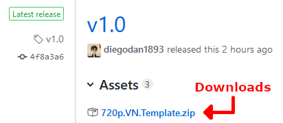

Examples and templates
======================

Templates
---------

Trying to create config files and basic assets for your game completely from scratch
can be hard, especially if it's your first time doing so. These templates can help
you getting started by providing a base you can customize to your needs.

Each template targets a common game resolution and comes with:

* A config file with all the settings you need
* An example folder structure for your project
* A font you can use to render the text in your game
* Necessary images to display the text window and choices menu
* Some example transition images
* An example icon
* Some GUI sounds

You can download templates from the `GitHub repo <https://github.com/diegodan1893/Iris-Engine-Templates/releases/latest>`_.

Examples
--------

Here are some
`complete games <https://github.com/diegodan1893/Iris-Engine-Examples>`_
you can use as a learning resource:

`Iris Engine showcase <https://github.com/diegodan1893/Iris-Engine-Examples/releases/latest>`_
	A simple game showcasing all the basic features of the engine. It also includes
	a basic Pong minigame.

Exploration game (coming soon)
	A more complex game with Ace Attorney-like exploration segments showing what
	is possible if you are familiar with the `Lua programming language <https://www.lua.org/>`_.
