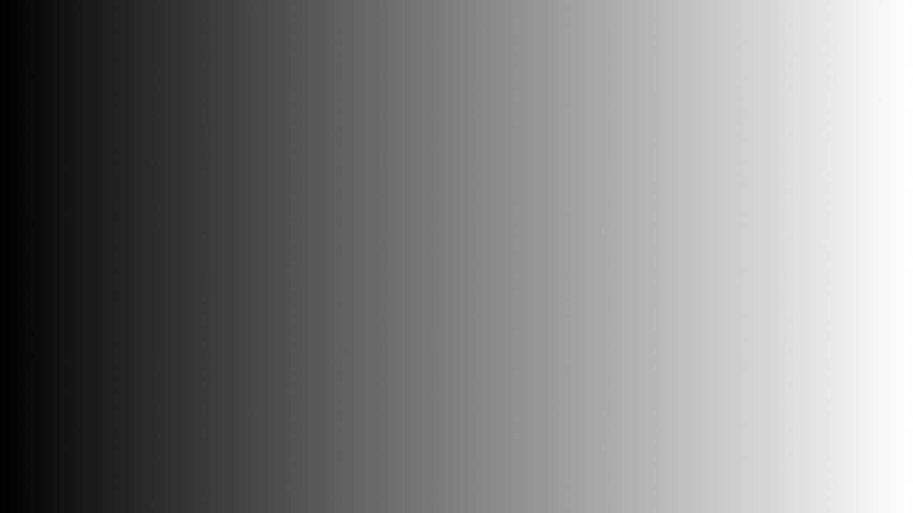
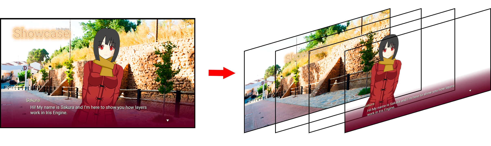
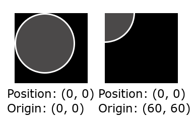
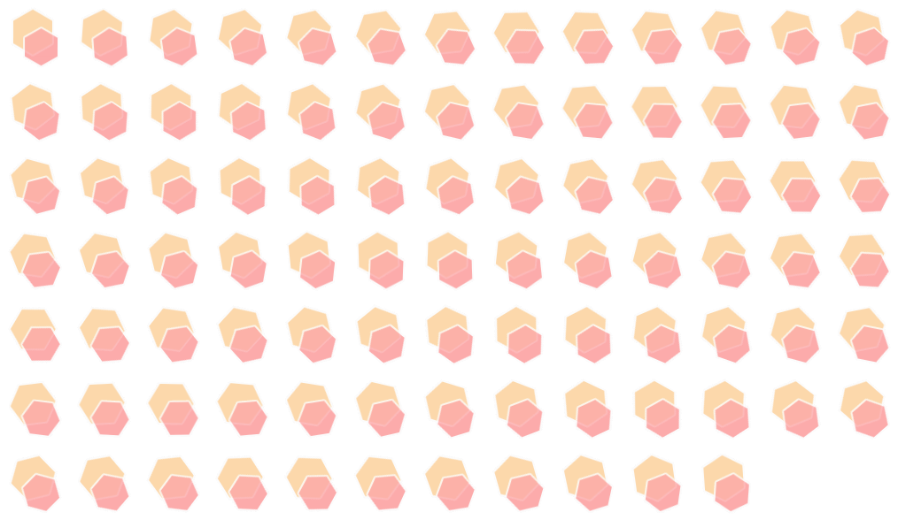
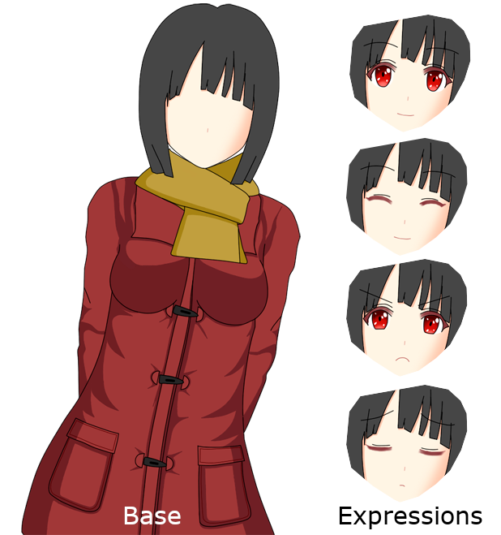
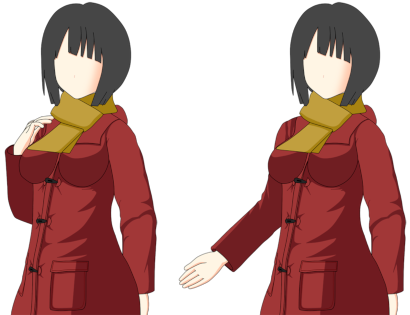
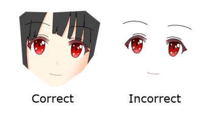

Working with visuals
====================

What's a visual novel without images? In this section you will learn how Iris Engine
handles the visual part of visual novels.

.. tip::
	It is highly recommended that you read the section :doc:`language/top`
	before this one.

Backgrounds
-----------

The action of your novel will probably take place somewhere. This is usually shown
to the player by drawing an image that fills the entire screen behind the characters.
These images are called backgrounds.

.. note::
	In the current version of the engine all backgrounds must have the same
	resolution. This will be fixed in a future release.

.. _using-scene-function:

Using the scene function to change the background
^^^^^^^^^^^^^^^^^^^^^^^^^^^^^^^^^^^^^^^^^^^^^^^^^

Most of the time, when you need to change the background it's because the action is
moving to a different place, so you also need to hide the rest of the objects that
are currently being shown in the screen. In those cases, you can use
:doc:`the scene function<language/api/globals/scene>`.

This function will hide all the objects in the screen and change the background
image. Here is an example of its usage:

.. code-block:: lua

	-- Change the background to the image "sky.png"
	scene("sky.png")

Iris Engine searches for background images in the folder specified in
:doc:`the config file<config>`.

By default, this function will change the background using a dissolve transition
with a duration of 0.5 seconds that looks like this:

.. 560x315

.. raw:: html

	<video width="560" height=315 controls loop style="margin-bottom:24px">
		<source src="_static/scene_default.mp4" type="video/mp4">
	</video>

We can modify the duration of the transition adding a second parameter to the
function:

.. code-block:: lua

	-- This will use a dissolve transition with a duration of 1.5 seconds
	scene("sky.png", 1.5)

However, we can also use the scene function with other types of transitions. This
is done by passing a transition object as the second parameter of the function.

A transition object is just a set of parameters in curly brackets (``{}``) that
describe a transition. Let's some examples:

.. code-block:: lua

	-- We must specify the type of transition we want to use
	-- If we use 'Transition.none', no transition will be used
	-- and the background switch will be instant
	scene("sky day.png", {type=Transition.none})

	-- Other types of transitions require extra parameters:
	-- Use a dissolve transition with a duration of 1.5 seconds
	scene("street day.png", {type=Transition.dissolve, time=1.5})
	--> This produces the same result as 'scene("street day.png", 1.5)'

.. tip::
	You can read more about transition objects and types in the following page:
	:doc:`language/api/enums/transition`.

The imageDissolve transition
~~~~~~~~~~~~~~~~~~~~~~~~~~~~

There is a special type of transition that currently can only be used with
:doc:`the scene function<language/api/globals/scene>` called *image dissolve*.
This type of transition lets you create a dissolve transition that is controlled
with a grayscale image, where black pixels dissolve first and white pixels
dissolve last. This is best illustrated with an example.

An image dissolve transition using the following control image

produces this result:

.. raw:: html

	<video width="560" height=315 controls loop style="margin-bottom:24px">
		<source src="_static/imageDissolve_wipeRight.mp4" type="video/mp4">
	</video>

And here is what the code looks like:

.. code-block:: lua

	-- Use an imageDissolve transition with "wipe right.png" as the control image
	scene("sky day.png", {type=Transition.imageDissolve, time=1, image="wipe right.png"})

You can get really creative with these images to produce a lot of different effects.
Here is a video showing more examples. The control image used is shown in the top
right corner.

.. raw:: html

	<video width="560" height=315 controls loop style="margin-bottom:24px">
		<source src="_static/imageDissolve_examples.mp4" type="video/mp4">
	</video>

Iris Engine searches for transition images in the folder specified in
:doc:`the config file<config>`.

Using the setBackground function
^^^^^^^^^^^^^^^^^^^^^^^^^^^^^^^^

While most of the time you will use :ref:`the scene function<using-scene-function>`,
sometimes you might need to change the background without affecting the rest of the
scene. This is done using
:doc:`the setBackground function<language/api/globals/setBackground>`.

Let's see an example:

.. code-block:: lua

	-- Change the background to the image "street evening.png"
	setBackground("street evening.png")

The previous code will change the background using a dissolve transition with a
duration of 0.5 seconds:

.. raw:: html

	<video width="560" height=315 controls loop style="margin-bottom:24px">
		<source src="_static/setBackground_default.mp4" type="video/mp4">
	</video>

There is, however, a big difference between the scene and the setBackground
functions when it comes to transitions: while all scene transitions are
:term:`blocking<blocking transition>`, the setBackground function allows us to
decide if we want to use a :term:`blocking<blocking transition>` or a
:term:`non-blocking<non-blocking transition>` transition. The difference between the
two is that blocking transitions pause the execution of the script until the
transition has finished, while non-blocking transitions don't. Here is a video that
shows this difference:

.. raw:: html

	<video width="560" height=315 controls loop style="margin-bottom:24px">
		<source src="_static/blockingVSnonBlocking.mp4" type="video/mp4">
	</video>

The default transition of this function is non-blocking. We can control this
behavior by passing a custom transition object as the second parameter. Here is
the code of the previous video:

.. code-block:: lua

	s "First, I'm going to show you a blocking transition."

	-- Hide the text window so that the effect can be seen clearly
	hideText()

	-- Use a blocking dissolve with a duration of 2 seconds
	setBackground("street evening.png", {type=Transition.dissolve, time=2, block=true})

	s "As you can see, the next line of text doesn't show up until the transition has finished."
	s "Now let's see a non-blocking transition."
	hideText()

	-- Use a non-blocking dissolve with a duration of 2 seconds
	setBackground("street night.png", {type=Transition.dissolve, time=2, block=false})

	s "As you can see, the next line of text appears at the same time the transition starts."

As you can see, the ``block`` parameter is used to specify whether or not the
transition is blocking. This parameter is required for all transition types except
for ``Transition.none``, and the only function without this requirement is
:ref:`the scene function<using-scene-function>`.

.. _using-sprites:

Sprites
-------

Apart from backgrounds, you might also want to add other images to your game. In
order to do that, you will need to create a
:doc:`Sprite object<language/api/classes/sprite/top>` and store it in a variable.
Here is an example:

.. code-block:: lua

	-- Create a Sprite object
	ball = Sprite.new("ball.png", 1)

As you can see, in order to define a sprite you need to specify two parameters. The
first one is the filename of the image you want to use, while the second one is the
*z-index*.

While visual novels are 2D games, when two objects overlap we need to know which one
should be drawn on top of the other. For this reason, all objects that can be drawn
on the screen have a z-index. You can think of z-indexes as the layers of a drawing
program.

	The z-index tells the engine in which layer to draw the image

An object with greater z-index is always in front of an object with a lower z-index.
If two objects have the same z-index, the one that was defined last will be drawn
on top.

The z-index of the background and the text window is specified in
:doc:`the config file<config>`.

Showing sprites
^^^^^^^^^^^^^^^

Once the sprite is defined, we can make it appear on the screen using ``show`` like
this:

.. code-block:: lua

	-- First we define a sprite and store it in a variable called 'ball'
	ball = Sprite.new("ball.png", 1)

	-- Then we make it appear on the screen by calling ball:show()
	ball:show()

By default, the sprite will appear on the screen with a
:term:`non-blocking<non-blocking transition>` fade with a duration of 0.3 seconds,
but you can also specify a custom transition object:

.. code-block:: lua

	-- Show the sprite without a transtition
	ball:show({type=Transition.none})

	-- Show the sprite using a blocking fade transition with a duration of 5 seconds
	ball:show({type=Transition.fade, time=5, block=true})

.. tip::
	Transition objects can be stored in variables. This way, you don't have to
	write all of the parameters every time you want to use them.

	.. code-block:: lua

		-- Create a variable with a blocking fade with a duration of 0.5 seconds
		blockFade05 = {type=Transition.fade, time=0.5, block=true}

		-- Instead of writing the parameters, you can use the variable
		ball:show(blockFade05)

If you want to hide the sprite, you can use ``hide`` in the same way as ``show``:

.. code-block:: lua

	-- Hide the ball sprite with the default transition
	ball:hide()

	-- Hide the ball sprite with a custom transition
	ball:hide({type=Transition.fade, time=0.5, block=true})

Placement of sprites
^^^^^^^^^^^^^^^^^^^^

If you have been following along, you probably noticed that the sprites appear in
the top left corner of the screen. You can set the position of a sprite with
``setPosition(x, y)``, where ``x`` is the distance from the left of the screen
measured in pixels and ``y`` the distance from the top of the screen.

.. code-block:: lua

	-- Create a sprite named ball
	ball = Sprite.new("ball.png", 1)

	-- Place that sprite in the position (50, 60)
	ball:setPosition(50, 60)

When a sprite is in a certain position, the exact pixel of the image that lands
in that position is called the **origin**. By default, the origin is the top left
corner of the sprite, but you can change it with ``setOrigin(x, y)``. You can see
how this affects the position of the sprite in the following image:

.. code-block:: lua

	-- Set the origin of the sprite
	ball:setOrigin(60, 60)

Movement
^^^^^^^^

It is also possible to move the sprites around the screen with an animation. This
is done using ``move(x, y, time, shouldBlock)``, where ``x`` and ``y`` determine
the position you want to move the sprite to, ``time`` specifies the duration of the
animation in seconds, and ``shouldBlock`` sets whether or not the engine should
treat this animation as a :term:`blocking transition`.

.. code-block:: lua

	-- Move the ball sprite from its current position to (1112, 81)
	-- This animation will have a duration of 2 seconds and will be a blocking transition
	ball:move(1112, 81, 2, true)

You can specify the type of interpolation to use for this animation as an additional
parameter. These are the interpolators you can choose from:

* ``Interpolator.linear``
* ``Interpolator.easeIn``
* ``Interpolator.easeOut``
* ``Interpolator.easeInOut``

Interpolators are used to control the acceleration of the sprite during the
animation. The following video shows the differences between them:

.. raw:: html

	<video width="560" height=315 controls loop style="margin-bottom:24px">
		<source src="_static/interpolators.mp4" type="video/mp4">
	</video>

Here is an example of how to use them in a script:

.. code-block:: lua

	-- Move the ball sprite like in the previous example but using an ease-out interpolator
	ball:move(1112, 81, 2, true, Interpolator.easeOut)

When no interpolator is specified, ``Interpolator.easeInOut`` will be used by
default.

Animated sprites
^^^^^^^^^^^^^^^^

Iris Engine supports sprite sheets, which are images that describe an animation.
For example, the following image

results in this animation:

In order to create an animated sprite, you first need to define a Sprite object
with the sprite sheet you want to use as the image, and then use
``defineSpriteSheet(frameCount, cols, rows, fps)``, where ``frameCount`` is the
number of frames of your animation, ``cols`` and ``rows`` is the number of columns
and rows your sprite sheet has, and ``fps`` is the framerate of the animation.
After that, you can use this object in the same way as any other sprite.
Here is an example using the previous sprite sheet:

.. code-block:: lua

	-- Create an sprite using the sprite sheet as the image
	animated = Sprite.new("sprite sheet.png", 1)

	-- Define the properties of the sprite sheet
	-- 89 frames, 13 columns, 7 rows, 60 FPS
	animated:defineSpriteSheet(89, 13, 7, 60)

	-- Show the animated sprite
	animated:show()

Character sprites
-----------------

Character sprites are a special kind of sprites with added functionality to make
showing the characters of your games with different expressions easier.

Bases and expressions
^^^^^^^^^^^^^^^^^^^^^

In Iris Engine, character sprites are composed of a base, which is an image of the
character without a face, and a set of expressions.

The reason for this is that it allows us to reuse the same expressions with
different base images, which is really useful when a character has multiple outfits
or when we have multiple base images for the same character with slightly different
poses, such as in this example:

Each expression should be its own image file, with the same resolution as the base
image. For this reason, the best way to create these images is to separate the base
and the expressions in their own layers in your drawing program and then export
each layer separately.

Due to the way transitions work, expression images should include part of the base
image underneath the facial expressions, like this:

As for the name of the files, if the name of the base image is ``base.png``,
the expressions that will be used with that base image should be called
``base expression.png``. For example, if the base image is called ``sakura1.png``,
the images of the expressions should be called ``sakura1 smiling.png``,
``sakura1 angry.png``, ``sakura1 shy.png`` and so on. Of course, we can later tell
the engine to use these expressions with a different base image without having to
edit their names.

Making your characters express themselves
^^^^^^^^^^^^^^^^^^^^^^^^^^^^^^^^^^^^^^^^^

There are :doc:`several ways to define a character sprite<language/api/classes/characterSprite/constructor>`,
but the simplest one only requires the name of the base image to use:

.. code-block:: lua

	-- Define a character sprite that uses "sakura1.png" as the base image
	sakura = CharacterSprite.new("sakura1.png")

The sprite will be automatically placed in the center of the screen, so most of the
time you won't need to manually set its position.

Once defined, we can make the sprite appear on the screen using ``show``, but this
time we have to specify the expression to use:

.. code-block:: lua

	-- Show the character sprite with the expression "sakura1 smiling.png"
	sakura:show("smiling")

As was the case with simple sprites_, the transition used by default will be a
:term:`non-blocking<non-blocking transition>` fade with a duration of 0.3 seconds,
but you can specify a custom transition object as the second parameter.

``show`` is also used to change the expression of a character sprite that was
already visible:

.. code-block:: lua

	sakura:show("smiling")
	s "I'm smiling now."

	sakura:show("normal")
	s "And this is my neutral expression."

	sakura:show("laughing")
	s "And now I'm laughing."

In this case, the default transition is a dissolve instead of a fade.

Now, let's say we have a second base image called "sakura2.png" that should use the
same expression images as "sakura1.png". This can be achieved with
``setExpressionBase``:

.. code-block:: lua

	-- Define a character sprite that uses "sakura2.png" as the base image
	sakura = CharacterSprite.new("sakura2.png")

	-- Set "sakura1.png" as the expression base
	sakura:setExpressionBase("sakura1.png")

	-- Show the character sprite using "sakura2.png" as the base image
	-- and "sakura1 smiling.png" as the expression image
	sakura:show("smiling")

Placement and movement of Character Sprites
^^^^^^^^^^^^^^^^^^^^^^^^^^^^^^^^^^^^^^^^^^^

You can use ``setPosition`` and ``move`` in the same way as with simple sprites_,
however, keep in mind that the origin of character sprites is located at the
bottom center of the sprite, as this makes it easier to align them with the bottom
of the screen. You can also replace the ``x`` and ``y`` parameters in both functions
with one of the following options:

* ``Position.left``
* ``Position.center``
* ``Position.right``
  
This way, you don't have to figure out the exact coordinates of these positions by
yourself.

Switching the base of your characters
^^^^^^^^^^^^^^^^^^^^^^^^^^^^^^^^^^^^^

It is also possible to transition smoothly from one base image to another while the
character sprite is visible, allowing you to do things like this:

.. raw:: html

	<video width="560" height=315 controls loop style="margin-bottom:24px">
		<source src="_static/setBase.mp4" type="video/mp4">
	</video>

This is done with ``setBase(base, expressionBase, expression)``, where ``base`` is
the new base image to use, ``expressionBase`` is the name of the base image of the
expressions you want to use, and ``expression`` is the name of the expression you
want your character to make.

You can optionally add a custom transition object as the last parameter, otherwise
a :term:`non-blocking<non-blocking transition>` dissolve with a duration of 0.3
seconds will be used.

.. code-block:: lua

	-- Define a character sprite that uses sakura2.png as the base image
	sakura = CharacterSprite.new("sakura2.png")
	sakura:show("smiling")

	...

	-- Transition to sakura3.png using the set of expressions of sakura2.png
	sakura:setBase("sakura3.png", "sakura2.png", "smiling")

.. note::
	In the current version of the engine both base images must have the same
	resolution, otherwise one of the images will be stretched during the transition.
	This will be fixed in a future release.